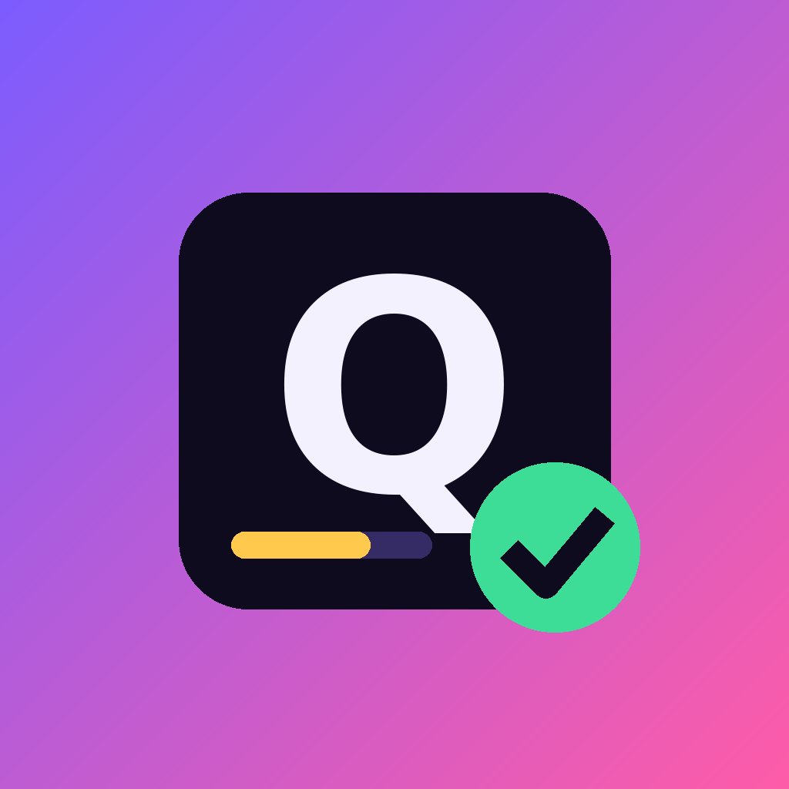
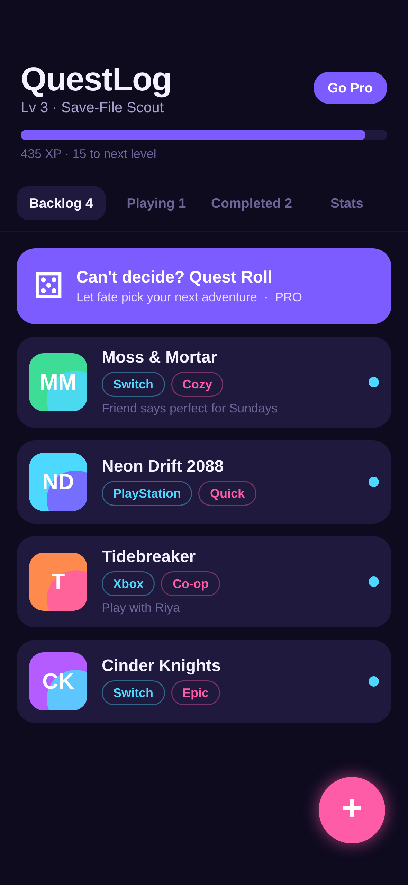
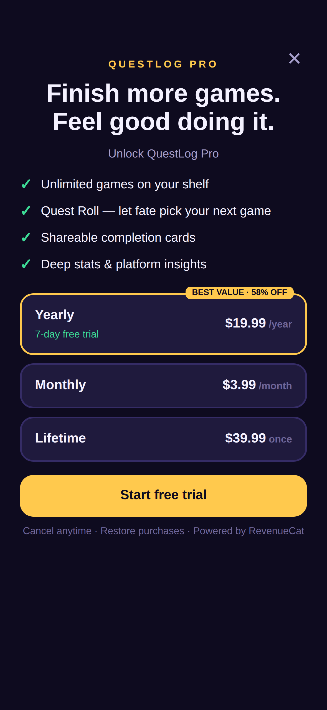
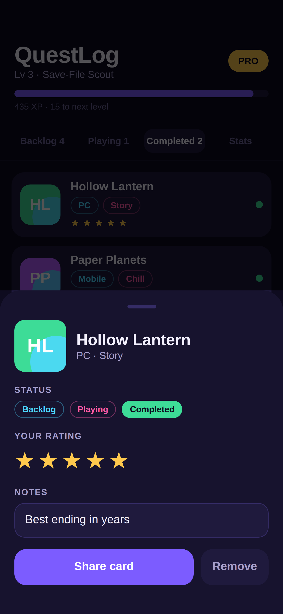
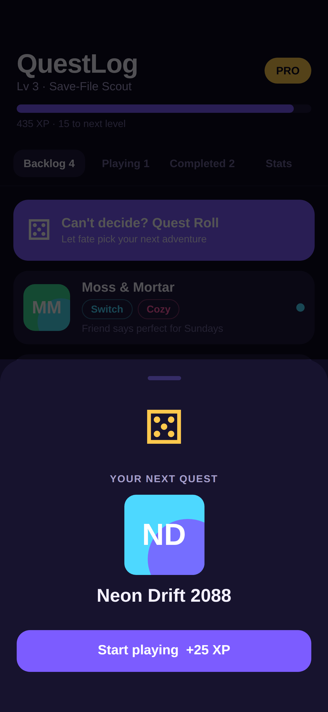
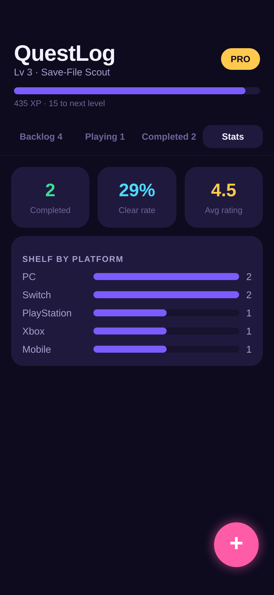

# QuestLog — your gaming bucket list, gamified



QuestLog helps players **save, organize, complete, rate and share** the games they want to play — and makes clearing the backlog feel like a game itself (XP, levels, titles). Built for **RevenueCat Shipaton 2026**.

| Backlog | Paywall | Rate | Quest Roll | Stats |
|---|---|---|---|---|
|  |  |  |  |  |

## Features
- **Save in seconds** — title, platform, vibe (Cozy / Epic / Quick / Co-op / Story / Chill)
- **Organize** — Backlog → Playing → Completed shelves, notes per game
- **Complete & rate** — 5-star ratings, completion dates
- **Share** — one-tap share cards (native share sheet)
- **Gamified** — XP for every action, levels and titles (*Couch Rookie → Legend of the Shelf*)
- **Quest Roll** — animated dice picks your next game when you can't decide
- **Stats** — completion rate, average rating, shelf by platform

## Monetization (RevenueCat)
| | Free | Pro |
|---|---|---|
| Games on shelf | 12 | Unlimited |
| Quest Roll, share cards, deep stats | – | ✓ |

Packages in the `default` offering, entitlement **`pro`**:
- Yearly **$19.99** with **7-day free trial** (anchor, "best value")
- Monthly **$3.99**
- Lifetime **$39.99**

Implementation: [`src/purchases.ts`](src/purchases.ts) — `Purchases.configure`, `getOfferings`, `purchasePackage`, `restorePurchases`, live `CustomerInfo` listener. The paywall is contextual: it opens when the user hits a Pro feature and tells them *which* feature they tried.

## Run
```bash
npm install
cp .env.example .env   # add RevenueCat public SDK keys
npx expo start          # Expo dev build required for native purchases
npx expo export -p web  # web preview (demo mode when no key set)
```
With no RevenueCat key the app runs in **demo mode** (simulated purchase) so it can be previewed on web.

### RevenueCat setup
1. Create project → add iOS/Android apps (`com.swapnil.questlog`).
2. Products: `questlog_pro_monthly`, `questlog_pro_yearly` (7-day trial), `questlog_pro_lifetime`.
3. Entitlement `pro` → attach all 3. Offering `default` with Monthly / Annual / Lifetime packages.
4. Put public SDK keys in `.env`, then `npx eas-cli build`.

## Tech
Expo SDK 57 · React Native 0.86 · TypeScript · react-native-purchases · AsyncStorage (offline-first, no account needed)

## License
MIT
